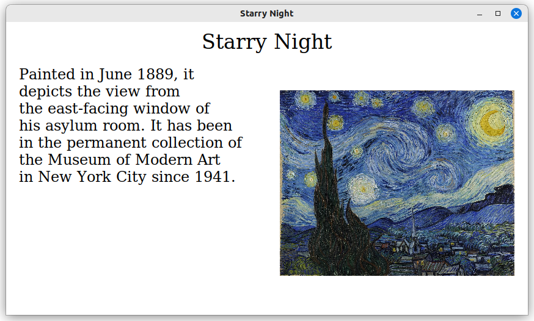

# illuscribe
Present slideshows from plaintext files.
Illuscribe is a simple program written in C using the Xlib and stb_image libraries. It parses plaintext files and renders them as presentations. Here is an example of a slideshow (with only one slide):
```
template: "default"
    box: "title", stack-vertical, align-center
    box: "content", stack-horizontal, align-left
end

slide: "opening-slide"
    uses: "default"
    define: "title"
        text: huge, "The Art of Vincent Van Gogh"
    end
    define: "content"
        text: normal, "Vincent Van Gogh was a Dutch post-impressionist painter who is among the most famous and influential figures in the history of Western art."
        text: normal, "Let's explore some of his most iconic works."
    end
end
```
## Syntax/Commands
Here are the basic commands:
- `slide: name` - Defines a slide. Slides contain boxes.
- `box: name, stack-direction, text-alignment` - Defines a box. Boxes can contain text and images.
- `define: name` - Add text or images inside of a define block, `name` specifies which box to add to.
- `text: size, content` - Add text to a box. Size can be `huge`, `title`, `normal`, or `small`.
- `image: filename` - Add an image with the specified filename.
- `end` - End a slide or define block.
- `template: name` - Exact same as defining a slide, except it will not be rendered.
- `uses: name` - Include a slide or template in another slide. You can then define boxes that are in those slides/templates.

## Usage
```
illuscribe <path-to-your-slideshow-file>
```
Also, it runs in 16:9 aspect ratio by default. If you have a different aspect ratio monitor you can specify the initial window dimensions like so:
```
illuscribe <path-to-you-slideshow-file> <window-width> <window-height>
```
## Installation
```
git clone https://github.com/masonarmand/illuscribe.git
cd illuscribe
sudo make install
```
